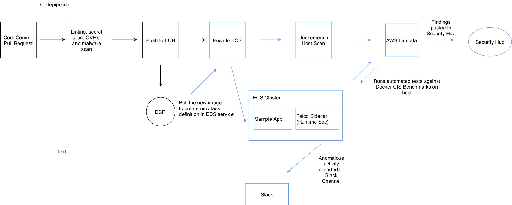

# Module 4 <small>Add a malware scanning stage</small>

**Time**: 10 minutes

In this stage, you will be scanning your image files for viruses, trojans, and other malware. For this stage you will be using <a href="https://www.clamav.net/" target="_blank">ClamAV</a>, an open source virus detection engine. ClamAV will look into your built docker image and identify any infected files using a database of virus signatures.

## Create the Build Spec file

1.	Click on your Cloud9 IDE tab.
2.	In the left file tree, expand the **configurations** folder and open **buildspec_malware.yml**.
3.	Review the YAML code below, paste it in the file, and save.

```yaml
version: 0.2

phases: 
  pre_build: 
    commands:
      - apt-get update
      - apt-get install -y clamav
      - freshclam
      - apt-add-repository ppa:duggan/jo --yes
      - apt-get update -q
      - apt-get install jo
      - apt-get install python3-pip
      - pip3 install awscli --upgrade --user

  build: 
    commands:
      - IMAGE="current_app"
      - docker build $CODEBUILD_SRC_DIR_AppSource -t $IMAGE
      - SCAN_RESULTS=$(clamscan -r -i /var/lib/docker || true) 
     
  post_build:
    commands:
      - echo $SCAN_RESULTS
      - JSON_STRING=$(jo -p scanresults="$SCAN_RESULTS" repourl="$CODEBUILD_SOURCE_REPO_URL_AppSource")
      - if echo $SCAN_RESULTS | grep 'FOUND'; then aws lambda invoke --function-name $FUNCTION_ARN --invocation-type RequestResponse --payload "$JSON_STRING" malwareResponse && exit 1; fi
      - echo Build completed on `date`
```

## Commit all configuration changes

Since you've made changes to a number of files in the configuration repo, you need to commit those changes to ensure your pipeline is pulling in the right files.

```
cd /home/ec2-user/environment/configurations
git add .
git commit -m "Updated Build Spec files and configurations."
git push -u origin master
```

---

## Pipeline Architecture

Below is the current architecture of your pipeline.



After you have successfully configured the secrets scanning stage, you can proceed to the next module.
