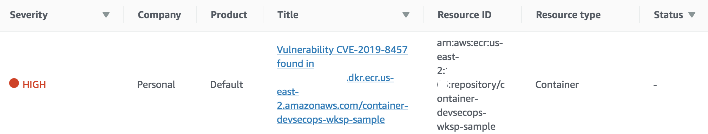
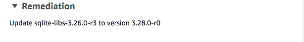

# Module 4 <small>Pipeline Testing</small>

**Time**: 50 minutes

Now that you have integrated multiple types of security testing into your pipeline you can test it to ensure your stages are effective in properly evaluating the security of your container-based applications.  While going through each stage you will fix any misconfiguration or vulnerability so that your sample application is able to successfully pass through each stage and is pushed to AWS ECR.

## Pipeline Architecture


1. **Commit**: Developer makes a commit to the *Development* branch.
2. **Pull Request**: Developer makes a Pull Request
    * Source Branch: *Developement*
    * Destination Branch: *Master*
3. **Triggers Rule**: A CloudWatch Event Rule is triggered based on the following events:
    * *pullRequestSourceBranchUpdated*
    * *pullRequestCreated*
4. **Invokes Function**: The AWS Lambda Function is setup as a target for the CloudWatch Event Rule and it is invoked after the CloudWatch Event Rule is triggered
5. **Posts comment**: The Lambda Function posts a comment to the Pull Request stating that the security testing is starting.

    **Starts Pipeline**:  The Lambda Function starts the CodePipeline.

6. **Pull Request Stage**: The stage pulls in these sources and stores them as artifacts in S3;
    *  CodeCommit repository: *container-devsecops-wksp-app (development branch)*
    *  CodeCommit repository: *container-devsecops-wksp-config (master branch)*
7. **Dockerfile Linting Stage**: The stage pulls in the artifacts from S3 and uses Hadolint (build spec file and configuration file pulled in from S3) to lint the Dockerfile to ensure it adheres to best practices.
8.  **Secrets Scanning Stage**: The stage runs high signal regex checks directly against the CodeCommit Repository (*container-devsecops-wksp-app - development branch*)
9.  **Vulnerability Scanning Stage**: The stage builds the container image, pushes it to ECR, and triggers an Anchore vulnerability assessment against the image.  If the scan results include any vulnerabilites that meet or exceed the threshold the build fails.  If the vulnerabilites are lower than the threshold the CodeBuild project will invoke a Lambda function with the scan results as the payload and the Lambda function will push the vulnerabilites into AWS Security Hub for future triaging since the risk for those have been accepted.
10.  **Publish Imaeg**: The last stage builds the image using the destination commit hash as the tag and publishes it to AWS ECR.
11. **CodeBuild Triggers**: If any CodeBuild Project fails a CloudWatch Event Rule is triggered.
12. **Triggers Lambda Function**: The Lambda Function is setup as a target for the CloudWatch Event Rule and is invoked after the CloudWatch Event Rule is triggered.
13. **Adds Feedback to Pull Request**:  The Lambda Function takes the results from each stage and CodeBuild project and posts a comment back to the Pull Requst.  This gives the developers fast feedback so they're able to fix any issues that are identified through the pipeline.

## Make a commit

Now you can test your pipeline to see how your Pull Requests result with an image being built and pushed to AWS ECR. First, make a commit to the *development branch* of your sample application

1.	Within your Cloud9 IDE expand your **sample application** on the left side.
2.  Open the **Dockerfile**.
3.  Add a name to the Label line.
4.  Update the version for `sqlite-libs` to the latest version published at [Alpine Linux Repo](https://pkgs.alpinelinux.org/package/edge/main/x86/sqlite-libs). Please, copy the whole version string, similar to, `3.26.0-r3`. 
5.  Push your commit.

```bash
    cd /home/ec2-user/environment/sample-application
    git add Dockerfile
    git commit -m "Modified Maintainer in Dockerfile"
    git push -u origin development
```

## Create a Pull Request

```bash
aws codecommit create-pull-request \
    --title "Updated Maintainer" \
    --description "Please review these changes." \
    --targets repositoryName=container-devsecops-wksp-app,sourceReference=development,destinationReference=master
```

Go to your <a href="https://us-east-2.console.aws.amazon.com/codesuite/codepipeline/pipelines/container-devsecops-wksp-pipeline/view" target="_blank">AWS CodePipeline</a> to view the progress and result.

## View the feedback loop

Each time a stage is run the results of the CodeBuild Project are posted back to the Pull Request to act as a feedback loop for developers.

1. Go to the <a href="https://us-east-2.console.aws.amazon.com/codesuite/codecommit/repositories/container-devsecops-wksp-app/pull-requests?region=us-east-2&status=OPEN" target="_blank">CodeCommit console</a>
2. Click on the latest Pull Request.
3. Click the **Activity** tab to view the feedback.

## Fix the Dockerfile linting defects

In the feedback you should see multiple defects that were identified by the Dockerfile linting stage.  The first defect can be fixed by modifying the hadolint configuration.

1. Click on your Cloud9 IDE tab.

2. In the left file tree, expand the **configurations** folder and open **hadolint.yml**.

3. Fix the defect:

    !!! info "Use of untrusted images"
        **DL3026**: Use only an allowed registry in the FROM image

        **Description**:  Using externally provided images can result in the same types of risks that external software traditionally has, such as introducing malware, leaking data, or including components with vulnerabilities. To prevent the use of externally provided images you should only pull images from trusted registries.

        **Fix**: Add `- docker.io` under ***trustedRegistries***.  
        
        **Explanation**:  Since the image is pulling from Dockerhub we can include it on the list so that the build is able to pass.  Adding Dockerhub is purely for testing purposes, in reality you would whitelist trusted registries that you host yourself or registries hosted by trusted 3rd parties.

        **Reference**: <a href="https://nvlpubs.nist.gov/nistpubs/SpecialPublications/NIST.SP.800-190.pdf" target="_blank">NIST SP 800-190: Application Container Security Guide - 3.1.5</a>

4.  Commit your configuration changes:

```bash
cd /home/ec2-user/environment/configurations
git add .
git commit -m "Added a trusted registry to hadolint configuration."
git push -u origin master
```

The next two defects can be fixed by modifying the Dockerfile.

1.  In the left file tree, expand the **sample-application** folder and open **Dockerfile**.

2. Fix the defects:

    !!! info "Image configuration defects"
        **DL3002**: Last USER should not be root.

        **Description**: To adhere the principals of least privileges, your containers should not be running as root.  Most containerized processes are application services and therefore don’t require root access. 

        **Fix**: Change USER to a non privileged user.  Add the following to the Dockerfile **underneath RUN apk**:

        `RUN addgroup -S sasquatch`

        `RUN adduser -S sasquatch -G sasquatch`

        Next, replace `USER root` with `USER sasquatch`

        **Explanation**: By creating a user in your Dockerfile, you are making it not only secure by default but also easier to keep secure.

        **Reference**: <a href="https://nvlpubs.nist.gov/nistpubs/SpecialPublications/NIST.SP.800-190.pdf" target="_blank">NIST SP 800-190: Application Container Security Guide - 3.1.2</a>

    !!! info "Image configuration defects"
        **DL3007**: Using latest is prone to errors if the image will ever update.
        
        **Description**: Latest is just a tag you add to an image and is no way dynamic.  It can be overwritten and prove difficult to understand what version of the software is installed.  Using the latest tag can effect the availability of your application and you should look at using a more explicit tag. 

        **Fix**: Pin the version explicitly to a release tag.  

        Replace `FROM python:latest` with `FROM python:3.7-alpine`

        **Reference**: <a href="https://nvlpubs.nist.gov/nistpubs/SpecialPublications/NIST.SP.800-190.pdf" target="_blank">NIST SP 800-190: Application Container Security Guide - 3.1.2</a>

Commit your application source code changes:

```bash
cd /home/ec2-user/environment/sample-application
git add Dockerfile
git commit -m "Fixed Dockerfile linting issues."
git push -u origin development
```

Go to your <a href="https://us-east-2.console.aws.amazon.com/codesuite/codepipeline/pipelines/container-devsecops-wksp-pipeline/view" target="_blank">AWS CodePipeline</a> to view the progress and result.


**View the Pull Request Feedback**

Updating the Pull Request branch automatically triggers the pipeline again.  You can view the feedback to see if the defects were remediated.

1. Go to the <a href="https://us-east-2.console.aws.amazon.com/codesuite/codecommit/repositories/container-devsecops-wksp-app/pull-requests?region=us-east-2&status=OPEN" target="_blank">CodeCommit console</a>
2. Click on the latest Pull Request.
3. Click the **Activity** tab to view the feedback.

## Remove secrets

Based on the feedback you received in the Pull request you can see that secrets were identified in your code.  

1. Click on **Logs** in the comment or view the CodeBuild Project history to identify the secret and the file it is located in.
    
    !!! question "How could you improve the feedback loop to make it easier for the developer?"

2. Remove the secret from the file.

**Modify trufflehog configuration**

Currently your trufflehog configuration is scanning through all of your commits to identify secrets. Since you'll be removing any current secrets you can modify the configuration to only scan new commits to speed up the build.

1. In the left file tree, expand the **configurations** folder and open **buildspec_secrets.yml**.

2. Update your trufflehog configuration to only scan 1 commit deep.

Change this command:


\- trufflehog --regex --rules secrets_config.json --entropy=False "$APP_REPO_URL"

To this:
```bash
- trufflehog --regex --rules secrets_config.json --entropy=False --max_depth 1 "$APP_REPO_URL"
```

!!! info "The second line adds "--max-depth 1" which limits the scan depth."

Commit your configuration changes:

```bash
cd /home/ec2-user/environment/configurations
git add .
git commit -m "Modifed max-depth in trufflehog command."
git push -u origin master
```
Commit your application changes:

```bash
cd /home/ec2-user/environment/sample-application
git add .
git commit -m "Removed access key."
git push -u origin development
```

Go to your <a href="https://us-east-2.console.aws.amazon.com/codesuite/codepipeline/pipelines/container-devsecops-wksp-pipeline/view" target="_blank">AWS CodePipeline</a> to view the progress and result.


**View the Pull Request Feedback**

Updating the Pull Request branch automatically triggers the pipeline again.  You can view the feedback to see if the defects were remediated.

1. Go to the <a href="https://us-east-2.console.aws.amazon.com/codesuite/codecommit/repositories/container-devsecops-wksp-app/pull-requests?region=us-east-2&status=OPEN" target="_blank">CodeCommit console</a>
2. Click on the latest Pull Request.
3. Click the **Activity** tab to view the feedback.

You'll notice that your pipeline is still failing on the secrets stage.  If you look at the commit that's being scanned you'll see that the access key still exists in that commit because it is part of the diff. Make one more commit and you'll see that your build passes the secret scanning stage successfully.

1. In the left file tree, expand the **sample-application** folder and open **Dockerfile**.

2. Change the Label to the following:

```bash
LABEL maintainer="Sasquatch" version="1.0"
```

Commit your application source code changes:

```bash
cd /home/ec2-user/environment/sample-application
git add Dockerfile
git commit -m "Added version Label."
git push -u origin development
```

!!! info "Embedded clear text secrets"
    **Description**: Many applications require secrets to enable communication with other serivces or backend components.  When an application is packaged into an image, these secrets can be embedded directly into the image.  This creates a security risk in which anyone with access to the image can easily obtain the secrets.

    **Fix**: Remove secrets from source code and leverage a secure solution for managing secrets like <a href="https://aws.amazon.com/secrets-manager/" target="_blank">AWS Secrets Manager</a> or <a href="https://docs.aws.amazon.com/systems-manager/latest/userguide/systems-manager-parameter-store.html" target="_blank">AWS Systems Manager Parameter Store</a>.

    **Explanation**: Best practice is to the remove secrets from all previous commits and rotate any credential found but due to time constraints you removed the secret and modified the scanning tool to only scan new commits.

    **Reference**: <a href="https://nvlpubs.nist.gov/nistpubs/SpecialPublications/NIST.SP.800-190.pdf" target="_blank">NIST SP 800-190: Application Container Security Guide - 3.1.4</a>

**View the Pull Request Feedback**

Updating the Pull Request branch automatically triggers the pipeline again.  You can view the feedback to see if the defects were remediated.

1. Go to the <a href="https://us-east-2.console.aws.amazon.com/codesuite/codecommit/repositories/container-devsecops-wksp-app/pull-requests?region=us-east-2&status=OPEN" target="_blank">CodeCommit console</a>
2. Click on the latest Pull Request.
3. Click the **Activity** tab to view the feedback.

## View vulnerabilities

In the feedback you should see information regarding any vulnerabilities that were found in the image.  When you went through the environment setup you specified a vulnerability threshold of **"High"**, which means that the build will fail if an image contains any High or Critical vulnerabilities. Specifying a threshold allows you to put in a place a risk tolerance for different severities of vulnerabilities. This allows your developers to continue to move quickly with low risk vulnerabilities that can be triaged and fixed later on.  In the current setup, all vulnerabilities below the threshold will be pushed to AWS Security Hub.

Since the build fails the vulnerability analysis stage we need to fix the issue with so that the image does not contain any **"High"** rated vulnerabilitiy.

1.  Go to the <a href="https://us-east-2.console.aws.amazon.com/securityhub/" target="_blank">Security Hub</a> console.

2.  Click **Findings** in the left navigation

3.  Click the search field and select a filter of **Product Name** EQUALS **Default**. The resulting findings are all of the vulnerabilities found in the image.

4. Click on the **HIGH** rated vulnerability and check the **Description** for the vulnerability reported. E.g.

    

    Follow the URL in the [**Source URL**](http://cve.mitre.org/cgi-bin/cvename.cgi?name=CVE-2019-8457) to see additional information about the reported vulnerability.

    See the recommended **Remediation**. E.g.

    

!!!info "Image vulnerabilities"

        **Description**: Images are static archive files that include all of the components used to run an application.  Components within an image may be missing critical security updates or be outdated which can lead to exploitation and unauthorized system access.

        **Fix**: Containers should be looked at as immutable and as such shouldn't be patched directly. Instead the vulernabilities should be fixed upstream in the source code and configuration of the image and then the image should be rebuilt and published.  This ensures that all new containers instantiated from the image don't include the vulnerabilities.

        Update the affected package in Dockerfile:
        Following the recommended **Remediation** update the `sqlite` version to `3.28.0-r0` in the Dockerfile.

        `RUN apk add --no-cache sqlite-libs=3.28.0-r0`

        **Reference**: <a href="https://nvlpubs.nist.gov/nistpubs/SpecialPublications/NIST.SP.800-190.pdf" target="_blank">NIST SP 800-190: Application Container Security Guide - 3.1.1</a>

Commit your application source code changes:

```bash
cd /home/ec2-user/environment/sample-application
git add Dockerfile
git commit -m "Update sqlite version to fix CVE-2019-8457"
git push -u origin development
```

**View the CodePipeline**

Updating the Pull Request branch automatically triggers the pipeline again.  This time go to the pipeline to view your code progress through the security testing.

1. Go to the <a href="https://us-east-2.console.aws.amazon.com/codesuite/codepipeline/pipelines/container-devsecops-wksp-pipeline/view" target="_blank">CodePipeline console</a>
2. Scroll down as your code progresses through each stage.

## View Image

The last stage of the pipeline builds the image, publishes it to AWS ECR, and then merges athe Pull Request.  You'll see in the feedback that a message is posted regarding the outcome of this stage and you'll notice that the Pull Request has been merged.

1. Go to the <a href="https://us-east-2.console.aws.amazon.com/codesuite/codecommit/repositories/container-devsecops-wksp-app/pull-requests?region=us-east-2&status=Closed" target="_blank">CodeCommit console</a>
2. Click on the latest Pull Request.  You may need to change the filter to "Closed Pull Requests" since the last stage publishes the image, merges the code, and closes the PR.
3. Click the **Activity** tab to view the feedback.
4. Click the **AWS ECR repository** link.

Following tagging best practices, your image is tagged with the Git commit hash of your application.

---

Congratulations!  You've completed the **Integrating security into your container pipeline** workshop. You now have a CI/CD pipeline for securely building and publishing your container-based applications. You can proceed to the next module to clean up the resources in your account.
