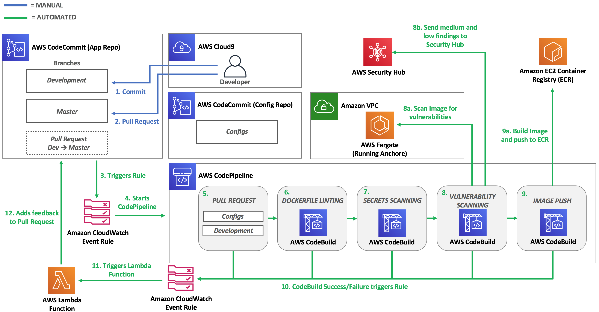

# Module 4 <small>Pipeline Testing</small>

**Time**: 30 minutes

Now that you have integrated multiple types of security testing into your pipeline you can test it to ensure your stages are effective in properly evaluating the security of your container-based applications.  While going through each stage you will fix any misconfiguration or vulnerability so that your sample application is able to successfully passes through each stage and is pushed to AWS ECR.

## Pipeline Architecture



1. **Commit**: Developer makes a commit to the *Development* branch.
2. **Pull Request**: Developer makes a Pull Request
    * Source Branch: *Developement*
    * Destination Branch: *Master*
3. **Triggers Rule**: A CloudWatch Event Rule is triggered based on the following events:
    * *pullRequestSourceBranchUpdated*
    * *pullRequestCreated*
4. **Starts CodePipeline**: The AWS CodePipeline is setup as a target for the CloudWatch Event Rule and it is started after the CloudWatch Event Rule is triggered
5. **Pull Request Stage**: The stage pulls in these sources and stores them as artifacts in S3;
    *  CodeCommit repository: *container-devsecops-wksp-app (development branch)*
    *  CodeCommit repository: *container-devsecops-wksp-config (master branch)*
6. **Dockerfile Linting Stage**: The stage pulls in the artifacts from S3 and uses Hadolint (build spec file and configuration file pulled in from S3) to lint the Dockerfile to ensure it adheres to best practices.
7.  **Secrets Scanning Stage**: The stage runs high signal regex checks directly against the CodeCommit Repository (*container-devsecops-wksp-app - development branch*)
8.  **Vulnerability Scanning Stage**: The stage builds the container image, pushes it to ECR, and triggers an Anchore vulnerability assessment against the image.  If the scan results include any vulnerabilites that meet or exceed the threshold the build fails.  If the vulnerabilites are lower than the threshold the CodeBuild project will invoke a Lambda function with the scan results as the payload and the Lambda function will push the vulnerabilites into AWS Security Hub for future triaging since the risk for those have been accepted.
9.  **Image Push**: The last stage builds the image using the destination commit hash as the tag and pushes it to AWS ECR.
10. **CodeBuild Triggers**: If any CodeBuild Project fails a CloudWatch Event Rule is triggered.
11. **Triggers Lambda Function**: The Lambda Function is setup as a target for the CloudWatch Event Rule and is invoked after the CloudWatch Event Rule is triggered.
12. **Adds Feedback to Pull Request**:  The Lambda Function takes the results from each stage and CodeBuild project and posts a comment back to the Pull Requst.  This gives the developers fast feedback so they're able to fix any issues that are identified through the pipeline.

## Make a commit

Now you can test your pipeline to see how your Pull Requests result with an image being built and pushed to AWS ECR. First, make a commit to the *development branch* of your sample application

1.	Within your Cloud9 IDE expand your **sample application** on the left side.
2.  Open the **Dockerfile**.
3.  Add a name to the Label line.
4.  Push your commit.

```
    cd /home/ec2-user/environment/sample-application
    git add Dockerfile
    git commit -m "Modified Maintainer in Dockerfile"
    git push -u origin development
```

## Create a Pull Request

```
aws codecommit create-pull-request \
    --title "Updated Maintainer" \
    --description "Please review these changes." \
    --targets repositoryName=container-devsecops-wksp-app,sourceReference=development,destinationReference=master
```

Go to your <a href="https://us-east-2.console.aws.amazon.com/codesuite/codepipeline/pipelines/container-devsecops-wksp-pipeline/view" target="_blank">AWS CodePipeline</a> to view the progress and result.

## View the feedback loop

Each time a stage is run the results of the CodeBuild Project are posted back to the Pull Request to act as a feedback loop for developers.

1. Go to the <a href="https://us-east-2.console.aws.amazon.com/codesuite/codecommit/repositories/container-devsecops-wksp-app/pull-requests?region=us-east-2&status=OPEN" target="_blank">CodeCommit console</a>
2. Click on the latest Pull Request.
3. Click the **Activity** tab to view the feedback.

## Stage 1: Fix Dockerfile linting issues

In the feedback you should see multiple issues that were identified by the Dockerfile linting stage.  The first issue can be fixed by modifying the hadolint configuration.

1. Click on your Cloud9 IDE tab.

2. In the left file tree, expand the **container-devsecops-wksp-config** folder and open **hadolint.yml**.

3.  **DL3026**: Use only an allowed registry in the FROM image

    **Fix**: Add `- docker.io` under **trustedRegistries** (for testing purposes)

4.  Commit your configuration changes:

```
cd /home/ec2-user/environment/container-devsecops-wksp-config
git add .
git commit -m "Added a trusted registry to hadolint configuration."
git push -u origin master
```

The next two issues can be fixed by modifying the Dockerfile.

1.  In the left file tree, expand the **sample-application** folder and open **Dockerfile**.

2. **DL3007**: Using latest is prone to errors if the image will ever update. Pin the version explicitly to a release tag

    **Fix**: Replace `FROM python:latest` with `FROM python:alpine3.7`

3. **DL3002**: Last USER should not be root

    **Fix**: Add `RUN groupadd -r sasquatch && useradd -r -g sasquatch sasquatch`
    
    **Fix**: Replace `USER root` with `USER sasquatch`

4.  Commit your application source code changes:

```
cd /home/ec2-user/environment/sample-application
git add Dockerfile
git commit -m "Fixed Dockerfile linting issues."
git push -u origin development
```

**View the Pull Request Feedback**
1. Go to the <a href="https://us-east-2.console.aws.amazon.com/codesuite/codecommit/repositories/container-devsecops-wksp-app/pull-requests?region=us-east-2&status=OPEN" target="_blank">CodeCommit console</a>
2. Click on the latest Pull Request.
3. Click the **Activity** tab to view the feedback.

## Stage 2: Remove secrets

Based on the feedback you received in the Pull request you can see that secrets were identified in your code.  

1. Click on **Logs** in the comment or view the CodeBuild Project history to identify the secret and the file it is located in.
    
    !!! question "How could you improve the feedback loop to remove this step?"

2. Remove the secret from the file.
3. Modify build spec to only scan a max depth of 1 commit (Removing secrets from previous commits and revoking any credentials are best practices but are not in scope due to time constraints.)
3. Commit your changes

## Stage 3: Vulnerability Scanning Stage

---

Congratulations!  You've completed the **Integrating security into your container pipeline** workshop. You can proceed to the next module to clean up the resources in your account.