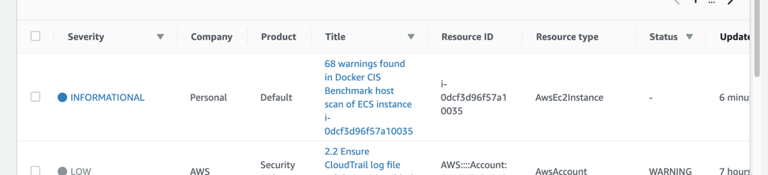

# Module 6 <small>Add a host security scan</small>

**Time**: 10 minutes

Next, you will be adding a host validation stage. Within this stage you will be utilizing <a href="https://github.com/docker/docker-bench-security" target="_blank">Docker Bench</a>, an open source set of scripts that compares and validates host machines against the <a href="https://www.cisecurity.org/cis-benchmarks/" target="_blank">Docker Community Edition CIS Benchmark</a>. 

## Create the Build Spec file

1.	Click on your Cloud9 IDE tab.
2.	In the left file tree, expand the configurations folder and open buildspec_hostscan.yml.
3.	Review the YAML code below, paste it in the file, and save.


```yaml
version: 0.2
phases:
  pre_build:
    commands:
    - apt-get update
    - apt-get install -y curl 
    - curl "https://s3.amazonaws.com/session-manager-downloads/plugin/latest/ubuntu_64bit/session-manager-plugin.deb" -o "session-manager-plugin.deb"
    - dpkg -i session-manager-plugin.deb
    - apt-get install -y jq
    - apt-get update -q
    - apt-get install -y jo
  build:
    commands: 
    - rm -f temp_script
    - touch temp_script
    - echo "#bin/bash" >> temp_script
    - echo "INSTANCE_ID=$INSTANCE_ID" >> temp_script
    - echo "S3_BUCKET=$S3_BUCKET" >> temp_script
    - echo "FUNCTION_ARN=$FUNCTION_ARN" >> temp_script
    - echo 'aws ssm send-command --instance-ids $INSTANCE_ID --document-name "AWS-RunShellScript" --comment "git clone" --parameters commands="git clone https://github.com/docker/docker-bench-security.git" --output json' >> temp_script
    - echo 'JSON=$(aws ssm send-command --instance-ids $INSTANCE_ID --document-name "AWS-RunShellScript" --comment "run script" --parameters commands="cd docker-bench-security && sudo sh docker-bench-security.sh" --output-s3-bucket-name $S3_BUCKET --output json)' >> temp_script
    - echo 'COMMAND_ID=$(jq .Command.CommandId <<< "$JSON")' >> temp_script
    - echo 'COMMAND_ID="${COMMAND_ID%\"}"' >> temp_script
    - echo 'COMMAND_ID="${COMMAND_ID#\"}"' >> temp_script
    - echo 'JSON_RESPONSE=$(aws ssm get-command-invocation --command-id $COMMAND_ID --instance-id $INSTANCE_ID --output json)' >> temp_script
    - echo  'while [ $(jq -r '.Status' <<< "$JSON_RESPONSE" ) != "Success" ]; do sleep 1 && JSON_RESPONSE=$(aws ssm get-command-invocation --command-id $COMMAND_ID --instance-id $INSTANCE_ID --output json); done' >> temp_script
    - echo 'RAW_SCAN=$(jq .StandardOutputContent <<< "$JSON_RESPONSE" )' >> temp_script
    - echo 'JSON_REQUEST=$(jo -p command_id="$COMMAND_ID" instance_id="$INSTANCE_ID" raw_scan="$RAW_SCAN" s3_bucket="$S3_BUCKET")' >> temp_script
    - echo 'aws lambda invoke --function-name $FUNCTION_ARN --invocation-type RequestResponse --payload "$JSON_REQUEST" hostscanresults' >> temp_script
  post_build:
    commands:
    - bash temp_script
    - echo Build completed on `date`
```

## Commit all configuration changes

Since you've made changes to a number of files in the configuration repo, you need to commit those changes to ensure your pipeline is pulling in the right files.

```
cd /home/ec2-user/environment/configurations
git add .
git commit -m "Updated HostScan buildspec."
git push -u origin master
```

1.  Navigate to Codepipeline in your AWS console and select the workshop pipeline.
2.	In the top right, select Release Change.

---

## View Scan Summary 

Once the pipeline runs all the way through, check security hub for the host scan summary.  



For more details:

1.  Click on the finding link below Title 
2.  Look for Source URL in the finding. Paste it into another tab in your browser
3.  This link will take you to an S3 bucket, where you can view the full report. 

Congratulations! You’ve added host scanning to your pipeline for the container host. This adds another layer of security for your containers running on the cloud, and will help you conform to the CIS Docker Benchmarks.