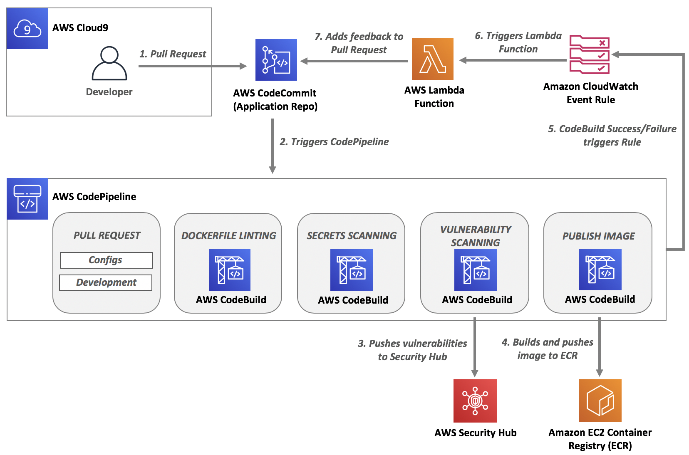

# Overview

In this workshop, you will learn how to leverage AWS development tools and open-source projects to integrate automated security testing into a CI/CD pipeline. You will learn about a variety of patterns for integrating security-centric release control into AWS CodePipeline. Additionally, you will learn how to add feedback loops and fix common security vulnerabilities in your container-based applications.

* **Level**: Advanced
* **Duration**: 2 - 3 hours
* **<a href="https://awssecworkshops.com/getting-started/" target="_blank">Prerequisites</a href>**: AWS Account, Admin IAM User
* **<a href="https://www.nist.gov/cyberframework/online-learning/components-framework" target="_blank">CSF Functions</a>**: Prevent, Detect
* **<a href="https://d0.awsstatic.com/whitepapers/AWS_CAF_Security_Perspective.pdf" target="_blank">CAF Components</a>**: Preventative, Detective
* **AWS Services**: <a href="https://aws.amazon.com/cloudwatch/" target="_blank">Amazon CloudWatch</a>, <a href="https://aws.amazon.com/codecommit/" target="_blank">AWS CodeCommit</a>, <a href="https://aws.amazon.com/codebuild/" target="_blank">AWS CodeBuild</a>, <a href="https://aws.amazon.com/codepipeline/" target="_blank">AWS CodePipeline</a>, <a href="https://aws.amazon.com/ecr/" target="_blank">Amazon ECR</a>, <a href="https://aws.amazon.com/lambda/" target="_blank">AWS Lambda</a>, and <a href="https://aws.amazon.com/security-hub/ " target="_blank">AWS Security Hub</a>
* **Open Source Projects**: <a href="https://github.com/hadolint/hadolint" target="_blank">Hadolint</a>, <a href="https://github.com/dxa4481/truffleHog" target="_blank">Trufflehog</a>, <a href="https://anchore.com/opensource/" target="_blank">Anchore</a>, and <a href="https://www.clamav.net/" target="_blank">ClamAV</a>

## Scenario

Your company has just kicked off a new DevSecOps initiative in an effort to improve the security of critical applications by embedding security in every part of the software development lifecycle.  You are part of a DevOps team tasked with integrating security testing into a rudimentary pipeline for building and releasing container images.  Your initial tasks include adding Dockerfile linting, secrets scanning, and vulnerability scanning.  The decision has been made to evaluate and make use of open source projects with the possibility of moving to a commercial offering based on how well the requirements are met. 

## Architecture

For this workshop you will start with a basic CI/CD pipeline that is triggered on Pull Requests and builds and pushes a container image to an Amazon ECR repository.  As you work through the tasks in your latest sprint you'll end up with the CI/CD pipeline as shown below.  It will include stages within your AWS CodePipeline for linting Dockerfiles, scanning for secrets, and scanning for vulnerabilities including an integration with AWS Security Hub.  In addition you will be using a combination of Amazon CloudWatch Event Rules and AWS Lambda Functions to create feedback loops for each stage of security testing.  This will allow your developers to quickly fix and iterate on their code which will lead to faster and more secure deliveries.

## Presentation deck

[Workshop Presentation Deck](./container-devsecops-presentation.pdf)

## Region

Please use the **us-east-2** (Ohio) region for this workshop.

---

This workshop is broken up into five modules.  Please click the bottom right button to proceed to the environment setup.